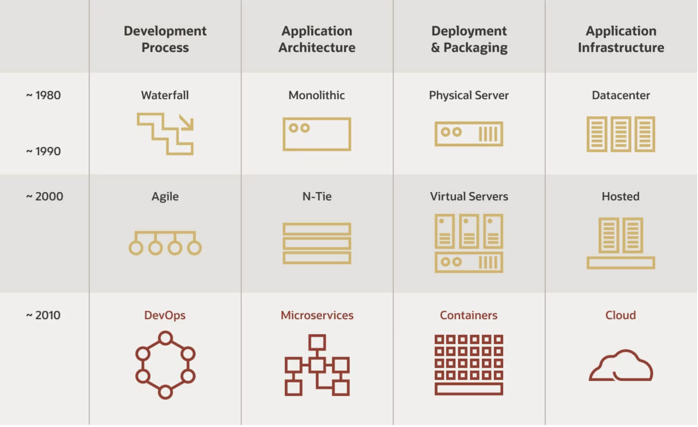
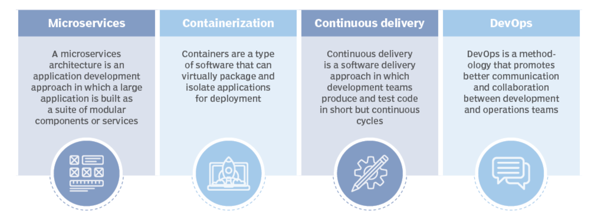

# CLOUD

[Azure Concepts](azure/ReadMe.md)

## Cloud Native

Approach to building and running applications that leverages cloud computing principles and technologies to take full advantage of the scalability, flexibility, and resilience offered by the cloud. It's a way of designing, developing, and deploying software that is well-suited for cloud environments.

**Cloud Native Evolution**

**Benefits of the Cloud-Native Model**

With cloud-native development, updates and new functionality can be pushed live whenever a new feature is ready with no disruption to app performance. Scaling up or down becomes quick, allowing businesses to better utilize resources and tap into customer needs in the blink of an eye.

- Reduced Time to Market : Cloud-native development allows for faster development and deployment of applications, which means that businesses can get their products to market faster than ever before.

- Improved Scalability : Cloud-native applications are designed to scale up or down as needed, which means that businesses can easily adjust to meet customer demand.

- Increased Flexibility : Cloud-native applications are designed to be flexible, which means that businesses can easily adjust to meet customer demand.

- Reduced Costs : The majority of businesses spent around 80% of their IT budget to support the existing infrastructure instead of investing in organizational development. At the same time, about 30% of data center capacity is generally not used. Cloud-native computing offers an organization another path and approach to infrastructure, shifting its budgets from expensive ecosystems working non-stop and channeling those savings into new functionality roll-out.

- No Vendor Lock-in : Sometimes 3rd party service providers choose to make an upgrade or changes to their policies without you agreeing to any updates. However, the situation is not a problem for cloud-native software. The businesses choosing cloud can shift to a different support vendor to leverage their cloud-native services and solutions

- Improved Customer Experience : Companies that can offer solutions that reflect their customer evolving demands faster are going to ride the wave. These businesses are likely to attract and retain the crème of the crop clients, who would appreciate such a customer-centric experience. Cloud-native tools give green light to continuous delivery, enabling engineers to offer software and app updates in short ongoing cycles.

**Key principles of cloud-native development**

## SLA Calculation

https://uptime.is/

## How to create a VPN between Azure and AWS

https://techcommunity.microsoft.com/t5/fasttrack-for-azure/how-to-create-a-vpn-between-azure-and-aws-using-only-managed/ba-p/2281900

[VPN-Azure-AWS](./images/aws-azure-vpn/VPN-Azure-AWS.pdf)
