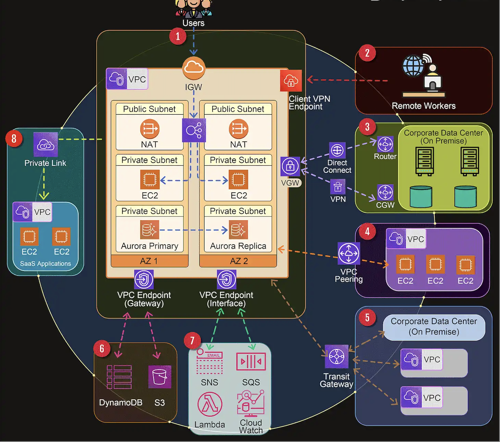

## IAM

### Service Role

AWS Identity and Access Management (IAM) `service roles` are special kinds of IAM roles that an `AWS service` assumes to perform actions on your behalf. Service roles provide permissions to AWS services so that they can perform tasks you specify.

Example Scenario:

- Suppose you have an Amazon EC2 instance that needs to read data from an S3 bucket. Instead of hardcoding access keys in your instance or manually granting access, you can create an IAM role with the necessary S3 read permissions and attach that role to your EC2 instance. The EC2 instance then `assumes` the role and uses its permissions to access the S3 bucket.
- You have an AWS Lambda function that processes images uploaded to an S3 bucket and stores the results in a DynamoDB table.
  - Create a service role for Lambda.
  - Attach a policy that allows the Lambda function to read from the S3 bucket and write to the
  - When the Lambda function runs, it `assumes` this role and uses the permissions to access S3 and DynamoDB.
- You have a containerized application running on Amazon ECS that needs to fetch secrets from AWS Secrets Manager and write logs to Amazon CloudWatch.
  - Create an ECS task role.
  - Attach a policy that grants permissions to read secrets from Secrets Manager and write logs to CloudWatch.
  - Assign this role to your ECS task definition so that the containers can access Secrets Manager and CloudWatch securely.

### PassRole

The `PassRole` permission in AWS Identity and Access Management (IAM) allows a user or service to pass an IAM role to an AWS service. This means that the user or service can specify which IAM role an AWS service (like EC2, Lambda, ECS, etc.) should assume to perform actions on their behalf. The PassRole permission is crucial for ensuring that only authorized users or services can delegate roles with specific permissions.

Example Scenario:

- Suppose you have a user who needs to launch EC2 instances with a specific IAM role that grants permissions to access S3 buckets.
  - Create the Role: Create an IAM role with a policy that allows access to S3 buckets.(Role Name : S3AccessRole)
  - Create a Policy with PassRole: Create an IAM policy that allows the user to pass the role to the EC2 service.

```json
{
  "Version": "2012-10-17",
  "Statement": [
    {
      "Effect": "Allow",
      "Action": "iam:PassRole",
      "Resource": "arn:aws:iam::123456789012:role/S3AccessRole"
    },
    {
      "Effect": "Allow",
      "Action": ["ec2:RunInstances", "ec2:TerminateInstances"],
      "Resource": "*"
    }
  ]
}
```

- Attach the Policy to the User: Attach the policy with the PassRole permission to the user.

The `PassRole` permission is required only when a user or service needs to delegate an IAM role to an AWS service. A user can still execute many service actions without needing PassRole permissions, but if the action involves passing an IAM role to a service, then PassRole is necessary.

## AWS Network Architecture



1. Internet Gateway (IGW)

   An IGW serves as the doorway between your AWS VPC and the internet, facilitating bidirectional communication. It is a horizontally scaled, redundant, and highly available VPC component that allows communication between instances in your VPC and the internet.

   Use Cases:

   - When you want your VPC to be connected to the internet for inbound or outbound traffic.
   - For public-facing services, such as web servers that need to be accessible from the internet.
   - To provide NAT (Network Address Translation) for instances with public IPs.

2. Client VPN Endpoint

   AWS offers a Client VPN service that enables remote workers to access AWS resources or an on-premises network securely over the internet. It provides a secure and easy-to-manage VPN solution.

   Client VPN Endpoint is a fully managed service that enables you to securely access your AWS resources and on-premises networks over a secure VPN connection from any location using an OpenVPN-based client.

   Use Cases:

   - Securely access AWS resources from a remote location (e.g., remote workers).
   - Provide developers or admins with secure, encrypted access to VPCs.
   - Implement a zero-trust security model by requiring VPN for accessing AWS resources.

3. Virtual Gateway (VGW)

   A Virtual Private Gateway (VGW) is a VPN concentrator on the Amazon side of your VPN connection. It enables you to establish a VPN connection between your on-premises network and your VPC.

   Use Cases:

   - Establishing site-to-site VPN connections between your on-premises network and your AWS VPC.
   - Connecting multiple on-premises networks to a single AWS VPC.
   - When you want to create a hybrid cloud architecture with AWS.

4. VPC Peering
   VPC Peering allows you to connect two VPCs, enabling you to route traffic between them using private IPv4 or IPv6 addresses.

   VPC Peering is a networking connection between two VPCs that enables you to route traffic between them using private IP addresses.

   Use Cases:

   - Connecting VPCs within the same region or across different regions for inter-VPC communication.
   - Allowing communication between different environments, such as development and production environments, hosted in separate VPCs.
   - Sharing resources between different AWS accounts.

5. Transit Gateway

   AWS Transit Gateway acts as a network transit hub, enabling you to connect multiple VPCs, VPNs, and AWS accounts together.

   AWS Transit Gateway enables you to connect your VPCs and on-premises networks through a central hub. It acts as a cloud router, simplifying your network topology.

   Use Cases:

   - Connecting multiple VPCs across different regions or accounts through a single gateway.
   - Centralizing network connectivity and management for large-scale, complex network architectures.
   - Reducing the number of point-to-point VPC connections, thereby simplifying routing and management.

6. VPC Endpoint (Gateway)

   A VPC Endpoint (Gateway type) allows you to privately connect your VPC to supported AWS services and VPC endpoint services powered by PrivateLink without requiring an internet gateway, VPN.

   A VPC Endpoint (Gateway) enables you to privately connect your VPC to supported AWS services like S3 and DynamoDB, without requiring an Internet Gateway, NAT device, VPN connection, or AWS Direct Connect connection.

   Use Cases:

   - Accessing S3 or DynamoDB from within your VPC without going through the internet.
   - Reducing data transfer costs by keeping traffic within the AWS network.
   - Enhancing security by avoiding exposure to the public internet.

7. VPC Endpoint (Interface)

   An Interface VPC Endpoint (powered by AWS PrivateLink) enables private connections between your VPC and supported AWS services, other VPCs, or AWS Marketplace services, without requiring an IGW, VGW, or NAT device.

   A VPC Endpoint (Interface) is an elastic network interface in your subnet that provides private connectivity to supported AWS services (like EC2, ECS, API Gateway) over the AWS network.

   Use Cases:

   - Privately accessing AWS services without exposing your traffic to the internet.
   - Integrating with AWS services like Secrets Manager, Kinesis, or Lambda from within your VPC.
   - Improving security posture by avoiding internet exposure for service communications.

8. SaaS Private Link Connection

   AWS PrivateLink allows you to securely access services hosted on AWS or by third-party SaaS providers over the AWS network. It creates a private connection between your VPC and the service provider’s network.

   Use Cases:

   - Connecting to third-party SaaS applications from within your VPC without traversing the public internet.
     -Building secure integrations with partner services or your own applications hosted in different AWS accounts.
   - Simplifying network architecture and enhancing security for accessing external services.
