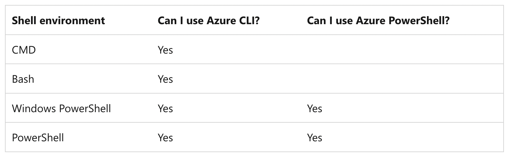

## command-line tool

https://learn.microsoft.com/en-us/powershell/

### Choose the right Azure command-line tool

https://learn.microsoft.com/en-us/cli/azure/choose-the-right-azure-command-line-tool

https://learn.microsoft.com/en-us/cli/azure/get-started-tutorial-0-before-you-begin#what-shell-environment-should-i-use

- Azure CLI:

  Cross-platform command-line interface, installable on Windows, macOS, Linux
  Runs in Windows PowerShell, Cmd, or Bash and other Unix shells.

- Azure PowerShell:

  Cross-platform PowerShell module, runs on Windows, macOS, Linux
  Requires Windows PowerShell or PowerShell

#### Commands

| **PowerShell Command**    | **Description**                                                                                                | **Azure CLI Equivalent**           |
| ------------------------- | -------------------------------------------------------------------------------------------------------------- | ---------------------------------- |
| `New-AzureADUser`         | Used to create a standard user.                                                                                | `az ad user create`                |
| `New-AzureADMSInvitation` | Used to invite external users as guests.                                                                       | `az ad user invite --invited-user` |
| `Set-AzMarketplaceTerms`  | When deploying a Marketplace resource for the first time, legal terms need to be accepted for the subscription |                                    |

https://learn.microsoft.com/en-us/powershell/module/azuread/new-azureadmsinvitation?view=azureadps-2.0

## Azure Backup : Recovery Services Vault vs Backup Vault

## Move Azure resources to a new resource group or subscription

https://learn.microsoft.com/en-us/azure/azure-resource-manager/management/move-resource-group-and-subscription#checklist-before-moving-resources
