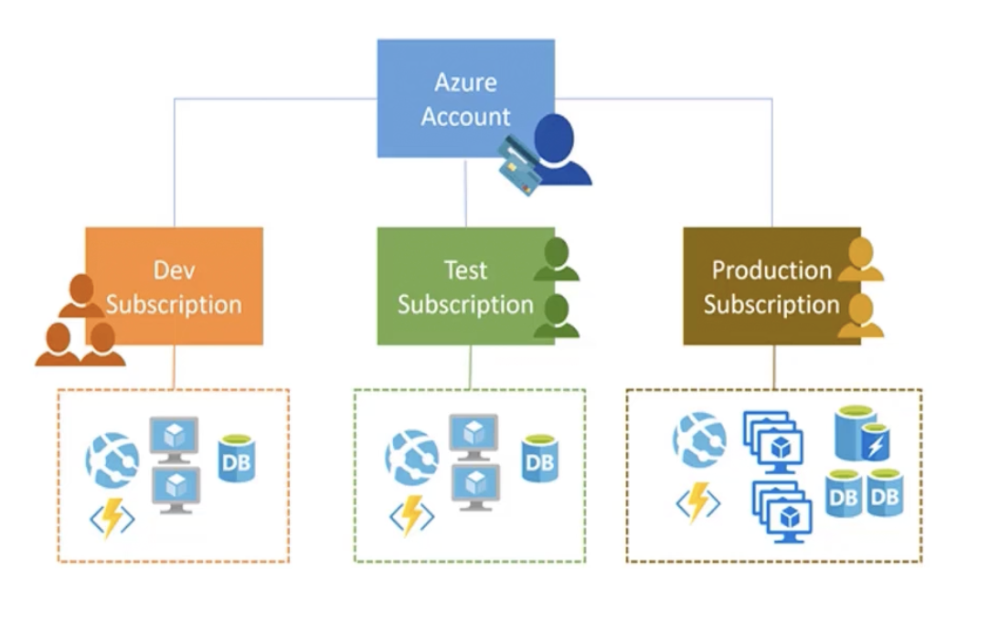
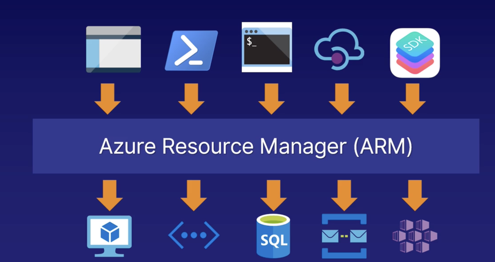
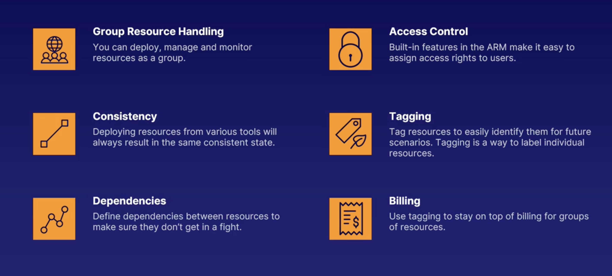
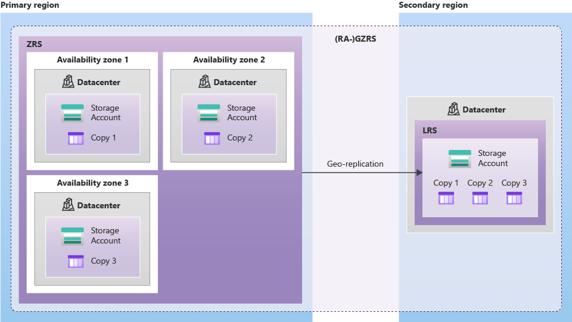

## Microsoft Entra ID

Microsoft Entra ID is a cloud-based identity and access management(IAM) service that enables your employees access external resources. Example resources include Microsoft 365, the Azure portal, and thousands of other SaaS applications.

## Azure tenant

A dedicated and trusted instance of `Microsoft Entra ID`. The tenant is automatically created when your organization signs up for a Microsoft cloud service subscription. These subscriptions include Microsoft Azure, Microsoft Intune, or Microsoft 365. An Azure tenant represents a single organization.

## Microsoft Entra directory

Every new Microsoft Entra directory comes with an initial domain name, for example `domainname.onmicrosoft.com`. In addition to that initial name, you can also add your organization's domain names. Your organization's domain names include the names you use to do business and your users use to access your organization's resources, to the list. Adding custom domain names helps you to create user names that are familiar to your users, such as alain@contoso.com.

For example, if my login name is `krishna@gmail.com` then my subscription name will be `krishnagmail-onmicrosoft-com`.

## Azure Subscription

Logical grouping of Azure resources. You can have multiple subscriptions per account.

Used to pay for Azure cloud services. You can have multiple subscriptions and they're linked to a credit card.

Each subscription has limits or quotas on the amount of resources it can use. You can change the limits by contacting Microsoft Support.

Security and billing boundaries for Azure resources.

`Direcctory` is my tenant. It is a container for all the users, groups, and applications in an organization. It is also an instance of Azure AD. It is also known as Azure AD Tenant.

What is Tenant ID?

- It is a unique identifier for your Azure AD Tenant. It is a GUID. It is also known as Directory ID.

### Azure Subscription Types

- Free Trial
- Pay-As-You-Go

## Resource Group

A logical container into which Azure resources like web apps, databases, and storage accounts are deployed and managed.

- Resource group is `not` a resource. It is a container for resources.

- Resource group is not a security boundary. It is a management boundary.
- Resource group is not a billing boundary. It is a management boundary.

- Resource groups can be used to scope access control for administrative actions.
- Resource groups can be used to scope billing.
- Resource groups can be used to scope RBAC permissions.
- Resource groups can be used to scope Azure policies.
- Each resource group can contain multiple resources.

### Resource Group Facts

- One Resource : Each resource can only exist in one resource group.
- Add / Remove : You can add or remove a resource to a resource group at any time.
- Move : You can move a resource from one resource group to another resource group.
- Delete : Deleting a resource group deletes all the resources in the group.
- Multiple Regions : Resources from multiple regions can be added to a single resource group.
- Resources can interaxct with other resources across resource groups.

- Resource grouops itself need to be created in a region. This is called the `Resource Group Region`. This is the region where the metadata for the resource group is stored. This is also the region where the resource group's logs are stored.

- Resource group region is not the same as the resource region.

## Azure Resource Manager (ARM)

ARM is a deployment and management service for Azure.

All interactions with Azure resources are go through ARM. It is the main Azure Architecture component for creating, updating, and manipulating resources.

- ARM provides a consistent management layer for all the resources in Azure.
- ARM provides security, auditing, and tagging features to manage resources.
- ARM provides a common set of APIs to manage resources.
- ARM provides a common set of tools to manage resources.
- ARM provides a common deployment model for all the Azure resources.
- ARM provides a common billing model for all the Azure resources.

<i>Azure vs AWS</i>

## Azure vs AWS

| Azure                                | AWS                               |
| ------------------------------------ | --------------------------------- |
| Virtual Machines (IaaS)              | EC2                               |
| AppServices (PaaS)                   | Elastic Beanstalk                 |
| Azure Functions                      | Lambda                            |
| NetWork Security Groups(NSGs)        | Security Groups                   |
| Virtual Networks or VNet             | Virtual Private Clouds(VPCs)      |
| Virtual Machine Scale Sets(VMSS)     | Auto Scaling Groups               |
| --------------------------------     | -------------------------------   |
| Azure Conatiner Instances(ACI)       | Elastic Container Service (ECS)   |
| Azure Kubernetes Service(AKS)        | Elastic Kubernetes Service(EKS)   |
| Azure Container Registry(ACR)        | Elastic Container Registry(ECR)   |
| --------------------------------     | -------------------------------   |
| Azure Virtual Desktop(AVD)           | Amazon WorkSpaces                 |
| Azure Content Delivery Network (CDN) | CloudFront                        |
| ExpressRoute                         | Direct Connect                    |
| Azure Blob Storage                   | Amazon S3                         |
| Azure Web Application Firewall(WAF)  | AWS Web Application Firewall(WAF) |
| Azure Monitor                        | CloudWatch                        |
| Azure Active Directory               | AWS IAM                           |
| --------------------------------     | -------------------------------   |
| Azure Load Balancer                  | Elastic Load Balancer(ELB)        |
| Application Gateway                  | AWS Application Load Balancer     |
| --------------------------------     | -------------------------------   |
| Azure Traffic Manager                | Route 53                          |
| Azure API Management                 | API Gateway                       |
| Azure SQL Database                   | Amazon RDS                        |
| Azure Database for MySQL             | Amazon Aurora                     |
| Azure Cosmos DB                      | DynamoDB                          |

<i>Azure Compute</i>

## Azure Functions

Azure Functions is a serverless compute service that enables you to run code on-demand without having to explicitly provision or manage infrastructure.

## Azure App Service

Azure App Service is a fully managed web hosting service for building web apps, mobile back ends, and RESTful APIs. It provides automatic scaling and high availability, supports both Windows and Linux, and enables automated deployments from GitHub, Azure DevOps, or any Git repo.

Applicaiton Types hosted in Azure App Service :

- Web Apps for Containers
- Web Apps
- API Apps

## Virtual Machine Scale Sets

Virtual Machine Scale Sets let you create and manage a group of identical, load balanced VMs. The number of VM instances can automatically increase or decrease in response to demand or a defined schedule. Scale sets provide high availability to your applications, and allow you to centrally manage, configure, and update a large number of VMs.

<i>Virtual Network (VNet)</i>

## Virtual Network (VNet)

Azure Virtual Network (VNet) is the fundamental building block for your private network in Azure. VNet enables many types of Azure resources, such as Azure Virtual Machines (VM), to securely communicate with each other, the internet, and on-premises networks. VNet is similar to a traditional network that you'd operate in your own data center, but brings with it additional benefits of Azure's infrastructure such as scale, availability, and isolation.

Vnet belongs to a single Azure region. Every resource in a Vnet belongs to the same region.

Vnet belongs to a single subscription. Every resource in a Vnet belongs to the same subscription. A resource in one subscription cannot be added to a Vnet in another subscription.

Vnet can be connected to other Vnets in the same region or in different regions. This is called `Vnet peering`.

Vnet can be connected to on-premises networks. This is called `Vnet gateway`.

### Advantages of VNet

- VNet provides isolation and segmentation of resources.
- VNet provides control over IP address ranges, DNS settings, security policies, and route tables within a network.
- VNet provides a way to connect Azure resources to each other and to on-premises networks.
- VNet provides a way to connect Azure resources to the internet.

### Subnet

A range of IP addresses in your VNet. You can divide a VNet into multiple subnets for organization and security.

Smaller networks inside a Vnet. Subnets are used to divide a Vnet into smaller networks. Subnets are used to control the flow of network traffic.

### Network Security Group (NSG)

A Network Security Group (NSG) contains a list of security rules that allow or deny network traffic to resources connected to Azure Virtual Networks (VNet). NSGs can be associated with either subnets or individual network interfaces attached to Azure Virtual Machines (VM).

### Vnet Peering

VNet peering enables you to connect virtual networks. Once peered, the virtual networks appear as one, for connectivity purposes. The traffic between virtual machines in the peered virtual networks is routed through the Microsoft backbone infrastructure, much like traffic is routed between virtual machines in the same virtual network, through private IP addresses only.

### VPN Gateway

A VPN gateway is a `specific type` of Virtual network(Vnet) gateway that is used to send encrypted traffic between an Azure virtual network and an `on-premises` location over the public Internet. You can also use a VPN gateway to send encrypted traffic between Azure virtual networks over the `Microsoft network`.

Other types of virtual network gateways are discussed later in this article.

Vnet gateway + VPN = VPN gateway

### ExpressRoute

ExpressRoute lets you extend your on-premises networks into the Microsoft cloud over a private connection with the help of a `connectivity provider`.

ExpressRoute is a service that enables you to create private connections between Azure datacenters and infrastructure that’s on your premises or in a colocation environment. ExpressRoute connections don’t go over the public Internet, and they offer more reliability, faster speeds, lower latencies, and higher security than typical connections over the Internet.

<i>Azure Storage</i>

## Azure Storage

### Azure Blob Storage

Azure Blob storage is Microsoft's object storage solution for the cloud. Blob storage is optimized for storing massive amounts of unstructured data. Unstructured data is data that doesn't adhere to a particular data model or definition, such as text or binary data.

Blob storage is ideal for:

- Serving images or documents directly to a browser.
- Storing files for distributed access.
- Streaming video and audio.
- Writing to log files.
- Storing data for backup and restore, disaster recovery, and archiving.
- Storing data for analysis by an on-premises or Azure-hosted service.

### Azure File Storage

Azure Files offers fully managed file shares in the cloud that are accessible via the industry standard Server Message Block (SMB) protocol. Azure file shares can be mounted concurrently by cloud or on-premises deployments of Windows, Linux, and macOS. Additionally, Azure file shares can be cached on Windows Servers with Azure File Sync for fast access near where the data is being used.

### Azure Queue Storage

Azure Queue storage is a service for storing large numbers of messages that can be accessed from anywhere in the world via authenticated calls using HTTP or HTTPS. A single queue message can be up to 64 KB in size, and a queue can contain millions of messages, up to the total capacity limit of a storage account. Queue storage is often used to create a backlog of work to process asynchronously.

### Azure Table Storage

Azure Table storage is a service that stores structured NoSQL data in the cloud, providing a key/attribute store with a schemaless design. Because Table storage is schemaless, it's easy to adapt your data as the needs of your application evolve. Access to Table storage data is fast and cost-effective for many types of applications, and is typically lower in cost than traditional SQL for similar volumes of data.

### Azure Disk Storage

Azure Disk Storage gives you the durability, availability, and security you need for your virtual machines whether you need the highest availability for mission-critical workloads, or cost-effective options for test scenarios.

### Azure Data Lake Storage

Azure Data Lake Storage Gen2 is a set of capabilities dedicated to big data analytics, built on Azure Blob storage. Data Lake Storage Gen2 is the result of converging the capabilities of our two existing storage services, Azure Blob storage and Azure Data Lake Storage Gen1. We recently announced a set of new features in Data Lake Storage Gen2:

- Hadoop compatible access
- Azure Active Directory-based access control
- Azure Data Lake Storage Gen2 is the best destination for your big data analytics workloads because of its massive scalability and cost effectiveness.

### Azure Storage Account

A storage account provides a unique namespace in Azure for your data. Every object that you store in Azure Storage has an address that includes your unique account name. The combination of the account name and the Azure Storage blob endpoint forms the base address for the objects in your account: `https://<youraccountname>.blob.core.windows.net`.

### Azure Storage Replication

Azure Storage offers several types of replication, each with its own durability and availability characteristics. You can choose the replication type that best suits your needs. The following table describes the replication options available for Azure Storage.

| Replication Type                           | Description                                                                                                                                                                                                                                                                                                                                                                                                                                                                                                         |
| ------------------------------------------ | ------------------------------------------------------------------------------------------------------------------------------------------------------------------------------------------------------------------------------------------------------------------------------------------------------------------------------------------------------------------------------------------------------------------------------------------------------------------------------------------------------------------- |
| Locally redundant storage (LRS)            | LRS copies your data synchronously three times within a single physical location in the primary region. LRS is the least expensive replication option, but is not recommended for applications requiring high availability.                                                                                                                                                                                                                                                                                         |
| Zone-redundant storage (ZRS)               | ZRS copies your data synchronously across three Azure availability zones in the primary region. ZRS is great for applications requiring high availability.                                                                                                                                                                                                                                                                                                                                                          |
| Geo-redundant storage (GRS)                | GRS copies your data synchronously three times within a single physical location in the primary region using LRS. It then copies your data asynchronously to a single physical location in a secondary region that is hundreds of miles away from the primary region. If an outage occurs in the primary region, Azure Storage fails over to the secondary region, and serves data from there until the primary region is restored. Once the primary region is available again, Azure Storage will fail back to it. |
| Read-access geo-redundant storage (RA-GRS) | RA-GRS provides the same durability and availability as GRS, with the added benefit of being able to read from the secondary region. RA-GRS is great for applications that require read access to data in the secondary region, or for data failover scenarios.                                                                                                                                                                                                                                                     |
|                                            |

**GRS**

