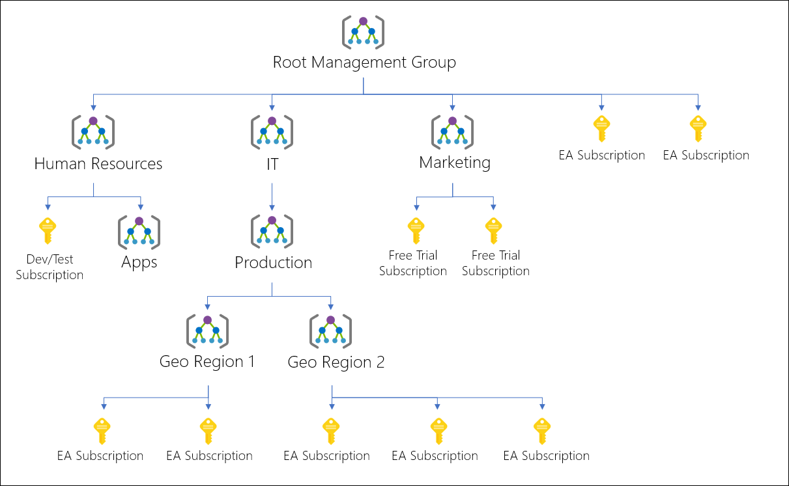
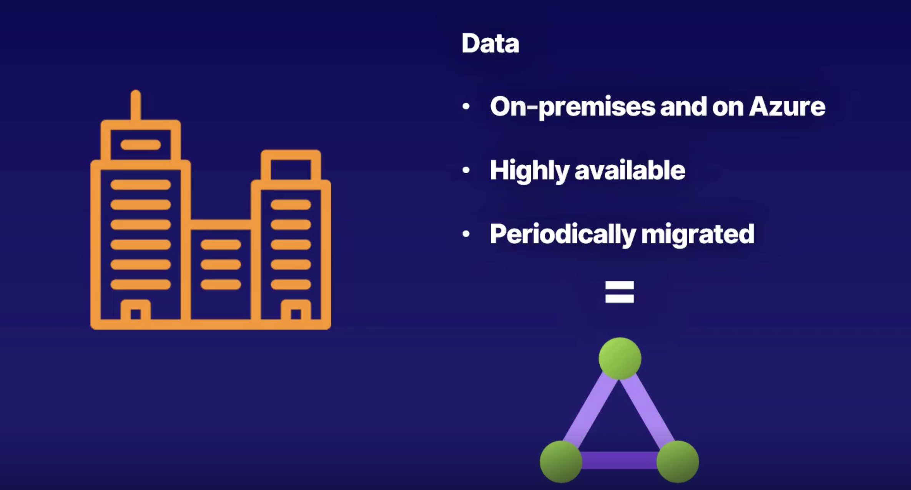
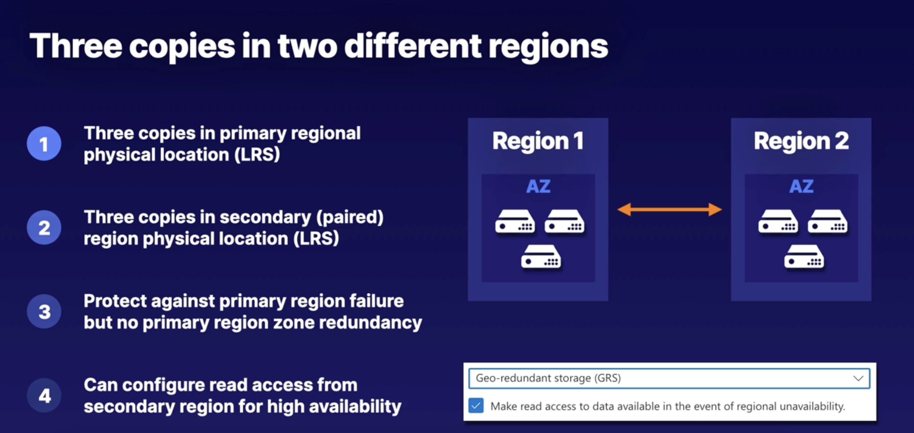

<details>
<summary><i>Azure Active Directory (AAD) - Microsoft Entra ID</i></summary>

## Azure Active Directory (AAD) - Microsoft Entra ID

Azure Active Directory (Azure AD), now known as `Microsoft Entra ID`, is an identity and access management solution from Microsoft that helps organizations secure and manage identities for hybrid and multicloud environments.

Microsoft Entra ID is a cloud-based identity and access management`(IAM)` service that enables your employees access external resources. Example resources include Microsoft 365, the Azure portal, and thousands of other SaaS applications.

Azure Active Directory (Azure AD) is Microsoft's cloud-based identity and access management service, which helps your employees sign in and access resources in:

- External resources, such as Microsoft 365, the Azure portal, and thousands of other SaaS applications.
- Internal resources, such as apps on your corporate network and intranet, along with any cloud apps developed by your own organization.

- You can't have Azure account without Azure AD service.
- First user : Every azure account needs a first user and this user is in the initial AAD instance. This user is called the `Global Administrator`.


## Active Directory

**Traditional office use** : Active directory was designed for traditional office use with computers and printers on a corporate network.

- It wasn't designed for the web
- Webservices were not part of the original vision for Active Directory in 2000

## Tenant (Directory)

A dedicated and trusted instance of `Microsoft Entra ID`. The tenant is automatically created when your organization signs up for a Microsoft cloud service subscription. These subscriptions include Microsoft Azure, Microsoft Intune, or Microsoft 365.

- An Azure tenant represents a single organization.
- Each Tenant has a unique ID & domain name.
- Each Tenant is distinct and completely separate from other Tenants.
- Each user in Azure can only belong to one Tenant. A user cannot be shared across Tenants. However, users can be guests in other Tenants (can be a guest of 499 other Tenants)

`Directory` is my tenant. It is a container for all the users, groups, and applications in an organization. It is also an instance of Azure AD. It is also known as Azure AD Tenant.

In general, an Azure AD tenant name ends with ‘onmicrosoft.com’, for example – abc.onmicrosoft.com, where ‘abc’ may be the name of an individual or an organization. In essence, a single tenant corresponds to a single instance of Azure Active Directory.

Although when an organization or an individual signs up for the first time, only a single tenant is created and associated, but multiple tenants can be created after signing up and, therefore, an `organization` can have more than one tenant, depending upon organizational requirement. Each tenant has its own Azure Active Directory, thereby having a one-to-one relation between the tenant and the Azure AD, where each tenant is referred to as an organization.

Let’s try to understand that with an example. There is a holding company called XYZ. This company decides to have 2 different tenants for its 2 subsidiaries.

- one tenant for subsidiary Contoso having subscriptions for Dev and Prod, and
- one tenant for subsidiary Fabrikam, again having subscriptions for Dev and Prod


These two tenants may be required based on XYZ internal organizational requirements in order to have maximum separation of concerns as well as have different settings and configurations for the two subsidiaries, which can be based on different geographies or regions.

As shown in the image above, a Tenant can have one or more subscriptions. This is the case in large organization, where there are different departments and each department has their own subscription, whereas, a Subscription can only be associated with a single Azure AD Tenant at any time.

### What is Tenant ID?

- It is a unique identifier for your Azure AD Tenant. It is a GUID. It is also known as Directory ID.

## Microsoft Entra directory

Every new Microsoft Entra directory comes with an initial domain name, for example `domainname.onmicrosoft.com`. In addition to that initial name, you can also add your organization's domain names. Your organization's domain names include the names you use to do business and your users use to access your organization's resources, to the list. Adding custom domain names helps you to create user names that are familiar to your users, such as alain@contoso.com.

For example, if my login name is `krishna@gmail.com` then my subscription name will be `krishnagmail-onmicrosoft-com`.

## Azure Active Directory B2B

Azure Active Directory (Azure AD) business-to-business (B2B) collaboration lets you securely share your company's applications and services with guest users from any other organization, while maintaining control over your own corporate data. You can also use B2B collaboration to allow your employees to share your company's applications and services securely with users from other organizations without needing to manage external user identities.

## Azure Active Directory Domain Services (AADDS)

Managed AD. Provides all classic AD features without the need to manage it yourself.

For Larger organisations, one of the largest barriers to full cloud adaptation is how to properly integrate old applications with modern cloud services.

Older applications are unable to use the latest authentication methods, such as OAuth2.0 are not able properly integrate or authentocate with Azure AD.

These legacy applications requires a tradional Active Directory Domain Services (AD DS) management / protocols which includes a classic Active directory features such as domain join, group policy, LDAP, and Kerberos/NTLM authentication.

How to solve this problem?

- Azure AD Connect : Continue using your on-premises AD and sync it with Azure AD.
- Self managed AD DS : Create a new AD server on Azure VM and manage it yourself.
- Azure Active Directory Domain Services (AADDS) : `Managed` AD DS. Provides all classic AD features without the need to manage it yourself.

For Larger organisations, one of the challenges of moving to the cloud is the need to manage user identities and credentials in two places. Azure Active Directory Domain Services (Azure AD DS) provides managed domain services such as domain join, group policy, LDAP, and Kerberos/NTLM authentication that are fully compatible with Windows Server Active Directory. You can consume these domain services without the need to deploy, manage, and patch domain controllers in the cloud. Azure AD DS integrates with your existing Azure AD tenant, thus making it possible for users to log in using their corporate credentials.

</details>

<details>
<summary><i>Management Group</i></summary>

## Management Group

A management group is a container that helps you manage access, policy, and compliance for multiple subscriptions. All subscriptions in a management group automatically inherit the conditions applied to the management group. Management groups give you enterprise-grade management at a large scale no matter what type of subscriptions you have.

The First Management Group is called the `Root Management Group`. It is the highest level in the hierarchy. It is the parent of all other management groups and subscriptions in your organization. By default, only the `Global Administrator` can manage the Root Management Group.

The Root Management Group is the only management group that can't be deleted and moved.

The first management group created in the directory could take up to `15 minutes` to complete. There are processes that run the first time to set up the management groups service within Azure for your directory. You receive a notification when the process is complete

If your organization has many Azure subscriptions, you may need a way to efficiently manage access, policies, and compliance for those subscriptions. Management groups provide a governance scope above subscriptions. You organize subscriptions into management groups; the governance conditions you apply cascade by inheritance to all associated subscriptions.

- You use Management groups to model your organization
- Management group can contain other management groups or subscriptions, but it cannot contain an Azure Resource.
- Management groups and subscriptions can only support one parent
- All subscriptions and management groups within a hierarchy share a common directory.
- Management groups reside within a tenant and cannot contain subscriptions of different tenants.
- A single directory can have up to 10,000 management groups

### Root management group

- All management groups in the Azure AD are under the root management group.
- Root management group cannot be moved or deleted.
- You can only have one root management group.

</details>

<details>
<summary><i>Azure Subscription</i></summary>

## Azure Subscription

Logical grouping of Azure resources. You can have multiple subscriptions per account.

Used to pay for Azure cloud services. You can have multiple subscriptions and they're linked to a credit card.

Each subscription has limits or quotas on the amount of resources it can use. You can change the limits by contacting Microsoft Support.

Security and billing boundaries for Azure resources.

- Billing Entity : All resources within a subscription are billed together.
- Cost Separation : You can use subscriptions to separate costs, such as by department or project. You can have multiple subscriptions within a tenant to separate costs.
- Access Control : You can use subscriptions to control access to resources. You can grant access to a subscription to users, groups, and applications.

### Subscription Design Strategies

- Workload separation strategy
- Application category strategy
- Mission-critical workloads
- Functional strategy
- Business unit strategy
- Geographic strategy
- Mix subscription strategies

### Azure Subscription Types

- Free Trial
- Pay-As-You-Go


</details>

<details>
<summary><i>Resource Group</i></summary>

## Resource Group

A logical container into which Azure resources like web apps, databases, and storage accounts are deployed and managed.

- Resource group is `not` a resource. It is a container for resources.

- Resource group is not a security boundary. It is a management boundary.
- Resource group is not a billing boundary. It is a management boundary.

- Resource groups can be used to scope access control for administrative actions.
- Resource Groups can simplify reporting and billing within Subscription.
- Resource groups can be used to scope RBAC permissions.
- Resource groups can be used to scope Azure policies.
- Each resource group can contain multiple resources.

- Resource groups are the lowest level of organizational scope, and are the level that contains almost all Azure Resources.

### Resource Group Facts

- One Resource : Each resource can only exist in one resource group.
- Add / Remove : You can add or remove a resource to a resource group at any time.
- Move : You can move a resource from one resource group to another resource group.
- Delete : Deleting a resource group deletes all the resources in the group.
- Multiple Regions : Resources from multiple regions can be added to a single resource group.
- Resources can interaxct with other resources across resource groups.


- Resource grouops itself need to be created in a region. This is called the `Resource Group Region`. This is the region where the metadata for the resource group is stored. This is also the region where the resource group's logs are stored.

- Resource group region is not the same as the resource region.


## Azure Resource Manager (ARM)

ARM is a deployment and management service for Azure.

All interactions with Azure resources are go through ARM. It is the main Azure Architecture component for creating, updating, and manipulating resources.

- ARM provides a consistent management layer for all the resources in Azure.
- ARM provides security, auditing, and tagging features to manage resources.
- ARM provides a common set of APIs to manage resources.
- ARM provides a common set of tools to manage resources.
- ARM provides a common deployment model for all the Azure resources.
- ARM provides a common billing model for all the Azure resources.


</details>

<details>
<summary><i>Management Groups vs Subscriptions vs Resource Groups</i></summary>

Azure Management Groups, Subscriptions, and Resource Groups are used together to establish the entire organizational structure in Azure, and they are designed to be flexible to organize Azure resources to meet business needs. This helps you efficiently manage access, policies, and compliance for the subscriptions.

If your organization has many subscriptions, you may need a way to efficiently manage access, policies, and compliance for those subscriptions. `Azure management groups` provide a level of scope above subscriptions.

To effectively organize `Azure resources`, define a hierarchy of management groups and subscriptions to which you can apply Azure Policy (and Initiative) and effectively manage the assignment of permissions via role-based access control (RBAC).

| Subscriptions   | Resource Groups | Management Groups |
| --------------- | --------------- | ----------------- |
| Billing         | Management      | Management        |
| Security        | Management      | Management        |
| Access Control  | Management      | Management        |
| Limits          | Management      | Management        |
| Billing Entity  | Management      | Management        |
| Cost Separation | Management      | Management        |




#### Best Practices

- Create separate Subscriptions/Management Groups for each Customer.
- Create separate Subscriptions/Management Groups for each Project.
- Create separate Subscriptions for different Environments (e.g. Dev, Stage, Prod).

</details>

<details>
<summary><i>Azure Account Structure</i></summary>

[Organization/Tenant/Azure AD Instance/Azure AD Directory]  
↕  
[Root Management Group]  
↓↓↓  
[(0 or more) Management Group]  
↓↓↓  
[Subscription]  
↓↓↓  
[Resource Group]  
↓↓↓  
[Resource]

- ↕ denotes a one-to-one correspondence.
- ↓↓↓ is meant to denote a 'one-to-many' relationship


</details>

## Azure Resources

<details>
<summary><i>Azure Compute</i></summary>

## Azure Functions

Azure Functions is a serverless compute service that enables you to run code on-demand without having to explicitly provision or manage infrastructure.


## Azure App Service

Azure App Service is a fully managed web hosting service for building web apps, mobile back ends, and RESTful APIs. It provides automatic scaling and high availability, supports both Windows and Linux, and enables automated deployments from GitHub, Azure DevOps, or any Git repo.

Applicaiton Types hosted in Azure App Service :

- Web Apps for Containers
- Web Apps
- API Apps

## Virtual Machine Scale Sets

Virtual Machine Scale Sets let you create and manage a group of identical, load balanced VMs. The number of VM instances can automatically increase or decrease in response to demand or a defined schedule. Scale sets provide high availability to your applications, and allow you to centrally manage, configure, and update a large number of VMs.

</details>

<details>
<summary><i>Virtual Network (VNet)</i></summary>

## Virtual Network (VNet)

Azure Virtual Network (VNet) is the fundamental building block for your private network in Azure. VNet enables many types of Azure resources, such as Azure Virtual Machines (VM), to securely communicate with each other, the internet, and on-premises networks. VNet is similar to a traditional network that you'd operate in your own data center, but brings with it additional benefits of Azure's infrastructure such as scale, availability, and isolation.

Vnet belongs to a single Azure region. Every resource in a Vnet belongs to the same region.

Vnet belongs to a single subscription. Every resource in a Vnet belongs to the same subscription. A resource in one subscription cannot be added to a Vnet in another subscription.

Vnet can be connected to other Vnets in the same region or in different regions. This is called `Vnet peering`.

Vnet can be connected to on-premises networks. This is called `Vnet gateway`.

### Advantages of VNet

- VNet provides isolation and segmentation of resources.
- VNet provides control over IP address ranges, DNS settings, security policies, and route tables within a network.
- VNet provides a way to connect Azure resources to each other and to on-premises networks.
- VNet provides a way to connect Azure resources to the internet.

### Subnet

A range of IP addresses in your VNet. You can divide a VNet into multiple subnets for organization and security.

Smaller networks inside a Vnet. Subnets are used to divide a Vnet into smaller networks. Subnets are used to control the flow of network traffic.

### Network Security Group (NSG)

A Network Security Group (NSG) contains a list of security rules that allow or deny network traffic to resources connected to Azure Virtual Networks (VNet). NSGs can be associated with either subnets or individual network interfaces attached to Azure Virtual Machines (VM).


### Vnet Peering

VNet peering enables you to connect virtual networks. Once peered, the virtual networks appear as one, for connectivity purposes. The traffic between virtual machines in the peered virtual networks is routed through the Microsoft backbone infrastructure, much like traffic is routed between virtual machines in the same virtual network, through private IP addresses only.

### VPN Gateway

A VPN gateway is a `specific type` of Virtual network(Vnet) gateway that is used to send encrypted traffic between an Azure virtual network and an `on-premises` location over the public Internet. You can also use a VPN gateway to send encrypted traffic between Azure virtual networks over the `Microsoft network`.

Other types of virtual network gateways are discussed later in this article.

Vnet gateway + VPN = VPN gateway

### ExpressRoute

ExpressRoute lets you extend your on-premises networks into the Microsoft cloud over a private connection with the help of a `connectivity provider`.

ExpressRoute is a service that enables you to create private connections between Azure datacenters and infrastructure that’s on your premises or in a colocation environment. ExpressRoute connections don’t go over the public Internet, and they offer more reliability, faster speeds, lower latencies, and higher security than typical connections over the Internet.




</details>

<details>
<summary><i>Azure Storage</i></summary>

## Azure Storage

### Azure Storage Account

Storage Account = Unique Azure Namespace

Every Object in Azure has its own web address. The address is made up of the storage account name and the endpoint domain name.

Example:

```
<youraccountname>.<storage-type>.core.windows.net
https://<youraccountname>.blob.core.windows.net
```

### Azure Blob Storage (Binary Large Object)

Azure Blob storage is Microsoft's object storage solution for the cloud. Blob storage is optimized for storing massive amounts of unstructured data. Unstructured data is data that doesn't adhere to a particular data model or definition, such as text or binary data.

Blob storage is ideal for:

- Serving images or documents directly to a browser.
- Storing files for distributed access.
- Streaming video and audio.
- Writing to log files.
- Storing data for backup and restore, disaster recovery, and archiving.
- Storing data for analysis by an on-premises or Azure-hosted service.

### Azure Blob Storage Types

- Block Blob : Block blobs are comprised of blocks, each of which is identified by a block ID. You create or modify a block blob by writing a set of blocks and committing them by their block IDs. Each block can be a different size, up to a maximum of 100 MB (4 MB for requests using REST versions before 2016-05-31), and a block blob can include up to 50,000 blocks. The maximum size of a block blob is therefore slightly more than 4.75 TB (100 MB X 50,000 blocks). If you are writing a block blob that is no more than 256 MB in size, you can upload it in its entirety with a single write operation; see Put Blob. Blocking is not supported for append blobs.

- Append Blob : An append blob is comprised of blocks and is optimized for append operations. Append blobs are ideal for scenarios such as `logging` data from virtual machines. You cannot modify the contents of an append blob after you have written to it. Instead, you add data to the end of the blob, so that you can maintain an `audit trail` of the data as it grows over time. An append blob can be up to 195 GB in size.

- Page Blob : A page blob is a collection of 512-byte pages optimized for random read and write operations. Any part of the file could be accessed at any time. The maximum size for a page blob is 8 TB. Page blobs store virtual hard drive (VHD) files and serve as disks for Azure virtual machines.

**Storage Levels**

Storage account can have a multiple blob containers. Each blob container can have multiple blobs. Each blob can have multiple snapshots.


**Pricing Tiers**


### Azure Disk Storage

Azure Disk Storage gives you the durability, availability, and security you need for your virtual machines whether you need the highest availability for mission-critical workloads, or cost-effective options for test scenarios.

- Magaged Disks : Managed Disks are the new and recommended disk storage offering for use with Azure Virtual Machines for persistent storage of data. You can use multiple Managed Disks with each virtual machine. Managed Disks are designed for 99.999% availability. Managed Disks offer two types of durable storage options: Premium and Standard Managed Disks. Premium Managed Disks are backed by SSD storage, and Standard Managed Disks are backed by HDD storage. You can use Managed Disks with Windows and Linux virtual machines.

  You don't have to worry about backup and uptime. Azure takes care of that for you.

**Disk Types**


- Premium SSD : Premium SSD Managed Disks are high-performance Solid State Drive (SSD) based Storage designed to support I/O intensive workloads with significantly high throughput and low latency. With Premium SSD Managed Disks, you can provision a persistent disk and configure its size and performance characteristics. Premium SSD Managed Disks are suitable for I/O-intensive applications and production workloads such as `SQL Server, Oracle, and SAP`.

### Azure File Storage

Azure Files offers fully managed file shares in the cloud that are accessible via the industry standard Server Message Block (SMB) protocol. Azure file shares can be mounted concurrently by cloud or on-premises deployments of Windows, Linux, and macOS. Additionally, Azure file shares can be cached on Windows Servers with Azure File Sync for fast access near where the data is being used.

### Azure Archive Storage

Azure Archive Storage offers the lowest storage costs of all Azure storage. Archive Storage provides secure, durable, and low-cost storage for rarely accessed data with flexible latency requirements (on the order of hours). Archive Storage stores data offline and is designed for applications that can tolerate several hours of latency when retrieving data.

### Azure Queue Storage

Azure Queue storage is a service for storing large numbers of messages that can be accessed from anywhere in the world via authenticated calls using HTTP or HTTPS. A single queue message can be up to 64 KB in size, and a queue can contain millions of messages, up to the total capacity limit of a storage account. Queue storage is often used to create a backlog of work to process asynchronously.

### Azure Table Storage

Azure Table storage is a service that stores structured NoSQL data in the cloud, providing a key/attribute store with a schemaless design. Because Table storage is schemaless, it's easy to adapt your data as the needs of your application evolve. Access to Table storage data is fast and cost-effective for many types of applications, and is typically lower in cost than traditional SQL for similar volumes of data.

### Azure Storage Replication (Redundancy)

Redundancy = Replication = Multiple Copies of Data

Azure Storage offers several types of replication, each with its own durability and availability characteristics. You can choose the replication type that best suits your needs. The following table describes the replication options available for Azure Storage.

Azure aklways maintains multiple copies of your data. The number of copies is based on the replication type you choose. **By default**, Azure Storage creates three copies of your data within a single region. This is called `Locally Redundant Storage (LRS)`. You can also choose to have Azure Storage maintain additional copies outside the region. This is called `Geo-Redundant Storage (GRS)`.


| Replication(Redundancy) Type      | Description                                                                                                                                                                                                                                                                                                                                                                                                                                                                                                         |
| --------------------------------- | ------------------------------------------------------------------------------------------------------------------------------------------------------------------------------------------------------------------------------------------------------------------------------------------------------------------------------------------------------------------------------------------------------------------------------------------------------------------------------------------------------------------- |
| Locally redundant storage (LRS)   | LRS copies your data synchronously three times within a single physical location in the primary region. LRS is the least expensive replication option, but is not recommended for applications requiring high availability.                                                                                                                                                                                                                                                                                         |
| Zone-redundant storage (ZRS)      | ZRS copies your data synchronously across three Azure availability zones in the primary region. ZRS is great for applications requiring high availability.                                                                                                                                                                                                                                                                                                                                                          |
| Geo-redundant storage (GRS)       | GRS copies your data synchronously three times within a single physical location in the primary region using LRS. It then copies your data asynchronously to a single physical location in a secondary region that is hundreds of miles away from the primary region. If an outage occurs in the primary region, Azure Storage fails over to the secondary region, and serves data from there until the primary region is restored. Once the primary region is available again, Azure Storage will fail back to it. |
| Geo-Zone Redundant Storage (GZRS) | GZRS copies your data synchronously across three Azure availability zones in the primary region using ZRS. It then copies your data asynchronously to a single physical location in a secondary region that is hundreds of miles away from the primary region. If an outage occurs in the primary region, Azure Storage fails over to the secondary region, and serves data from there until the primary region is restored. Once the primary region is available again, Azure Storage will fail back to it.        |

**LRS**


**ZRS**


**GRS**




**GZRS**


</details>

<details>
<summary><i>Moving Data</i></summary>

## Moving Data

Moving data into and out of Azure is a common operation. Azure provides several options for moving data.

Different solutions based on

- Amount of data
- Frequency of data
- Network Bandwidth

For **Smaller** and occasional data transfers :

- AzCopy

  - Transfer Blobs and Files
  - Command Line Tool
  - Useful for scripting data transfers

- Azure Storage Explorer

  - GUI Tool
  - Downloaded and installed on your computer
  - Userfriendly interface
  - Supports all Azure Storage types

- Azure File Sync

  - Works only with Azure Files
  - Syncs on-premises file servers with Azure Files
  - Local file server performance + cloud availability
  - Backup local file server
  - Synchorize files between multiple on-premises file servers

Transfer LOTS of data and/or limited network bandwidth :

- Azure Data Box

  - Physical device
  - Shipped to you
  - You copy data to the device
  - You ship the device back to Azure
  - Azure copies the data to your storage account

- Azure Migrate

Discovery and assessment tool discovers and assesses on-premises VMware VMs, Hyper-V VMs, and physical servers for migration to Azure. It assesses on-premises workloads for migration suitability, performance-based sizing, and cost estimations.

- Azure readiness: Assesses whether on-premises servers, SQL Servers and web apps are ready for migration to Azure
- Azure sizing: Estimates the size of Azure VMs/Azure SQL configuration/number of Azure VMware Solution nodes after migration.
- Azure cost estimation: Estimates costs for running on-premises servers in Azure.
- Discover dependent resources to migrate: Discovers dependencies between on-premises machines and group machines that need to be migrated together.
- Migrate non-Azure resources (Servers, Databases and Applications) to Azure
- Includes, but not limited to, storage accounts
- Migrate an on-premises datacenter to Azure
- Cloud to cloud migration

</details>

<details>
<summary><i>Databases</i></summary>

## Cosmos DB

Azure Cosmos DB is Microsoft's globally distributed, multi-model database service. With a click of a button, Cosmos DB enables you to elastically and independently scale throughput and storage across any number of Azure's geographic regions. It offers throughput, latency, availability, and consistency guarantees with comprehensive service level agreements (SLAs), something no other database service can offer.

Cosmos DB is a `NoSQL` database. It is a `schema-less` database. It is a `multi-model` database. It is a `globally distributed` database.

- One click to add or remove regions
- One click to add or remove throughput
- Continues sync across regions
- Promise of low latency (Single digit millisecond)
- Automatically scales to meet demand
- Even though scaling is automatic, you pay only for what you use

Disadvantages :

- Expensive. You pay for the promise of low latency and high availability.


## Azure SQL Database

Azure SQL Database is a fully managed relational database.

Fully Managed and using the latest stable version of `SQL Server Database` Engine.

You can migrate your existing `SQL Server databases` to Azure SQL Database without changing the application code. Azure SQL Database is a general-purpose relational database-as-a-service (DBaaS) based on the latest stable version of Microsoft SQL Server Database Engine. SQL Database is a high-performance, reliable, and secure database you can use to build data-driven applications and websites in the programming language of your choice, without needing to manage infrastructure.

- Built-in machine learning features :
  - Suggestions on how to improve performance of Azure SQL Instances
  - Suggestions on how to improve security of Azure SQL Instances
  - You will get warninngs for degraded instances, and anything out of the ordinary is happening

### Azure SQL Database vs Azure SQL Managed Instance (SQL MI)

Azure SQL Managed Instance (SQL MI) : To reduce the gap between the on-primes SQL Server and Azure SQL Database, Microsoft introduced Azure SQL Managed Instance. Azure SQL Managed Instance is a fully managed SQL Server Instance hosted in Azure cloud and placed in your Azure VNet. In this way, it combines the best aspects of SQL Server and Azure SQL Database.

Azure SQL Database : Azure SQL Database is a fully managed relational database with built-in intelligence supporting self-driving features such as performance tuning and threat alerts. Microsoft handles all patching and updating of the code base, but Azure SQL Database does not provide access to the underlying operating system or to SQL Server itself.


## Azure Database for MySQL

Azure Database for MySQL is a fully managed database service for app developers. MySQL is the world's most popular open-source database. The MySQL Community edition helps you easily lift and shift to the cloud, using languages and frameworks of your choice.

## Azure Database for PostgreSQL

Azure Database for PostgreSQL is a fully managed database as a service offering capable of handling mission-critical workloads with predictable performance and dynamic scalability. It combines the power of community PostgreSQL, with the capabilities of Azure, providing a managed database service for app development and deployment with minimal administration.

- Horizontal scaling with Hyperscale (Citus) : Hyperscale (Citus) is a built-in option in Azure Database for PostgreSQL that scales out your data across multiple nodes and can be used to achieve high performance and scale. Hyperscale (Citus) is a good fit for multi-tenant applications, SaaS applications, and applications that require real-time analytics over large datasets.

</details>

<details>
<summary><i>Service EndPoints vs Private Link</i></summary>

`Azure Service Endpoint` provides secure and direct connectivity to Azure PaaS services over an optimized route over the Azure backbone network. Traffic still left your VNet and hit the public endpoint of PaaS service.

`Azure Private Link` (Private Endpoint) allows you to access Azure PaaS services over Private IP address within the VNet. It gets a new private IP on your VNet. When you send traffic to PaaS resource, it will always ensure traffic stays within your VNet.

Use a private link, if you want to be able to block all internet traffic to a target resource.
Private Link is superior to Service Endpoint in Security

|                              | Service Endpoints                                                                              | Private Link                                                                                            |
| ---------------------------- | ---------------------------------------------------------------------------------------------- | ------------------------------------------------------------------------------------------------------- |
| Access                       | It remains a publicly routable IP address                                                      | It is a private IP in the address space of the virtual network where the private endpoint is configured |
| Data Exfiltration protection | Traffic need to be passed through an NVA/Firewall for exfiltration protection.                 | It has an inbuilt data protection                                                                       |
| On-Premise Connectivity      | it is not easily restrict on-premise traffic. They can only be secured to Azure VNet           | Easily extensible for On-premises network traffic via ExpressRoute or VPN tunnels                       |
| Complexity                   | It’s much simpler to implement and significantly reduce complexity of your architecture design | Need to manage another resource                                                                         |
| Cost                         | There is no additional cost for using VNet service endpoints.                                  | It costs can quickly grow depending on total ingress and egress traffic and runtime of the link.        |


</details>

<details>
<summary><i>App Services</i></summary>

<details>
<summary><i>VNet Integration</i></summary>

</details>

<details>

<summary><i>Access Restrictions</i></summary>

## Access Restrictions vs Network Security Groups (NSG)

## Access Restrictions

Access Restrictions is a feature of `App Service` that is closely integrated with Azure Virtual Networks. It allows you to define a set of rules that control which inbound traffic should be allowed to reach the app. The rules can be defined based on source IP address/subnet, or based on a Service Tag.

## Network Security Groups (NSG)

A network security group (NSG) contains a list of security rules that allow or deny network traffic to resources connected to Azure Virtual Networks (VNet). NSGs can be associated with either subnets or individual network interfaces attached to Azure Virtual Machines (VM).

</details>

</details>

<details>
<summary><i>Load Balancer</i></summary>

## Azure Load Balancer

Azure Load Balancer is a network load balancer that enables you to build highly scalable and highly available applications. Traditional load balancers operate at the transport layer (OSI layer 4 - TCP and UDP) and route traffic based on source IP address and port, to a destination IP address and port.

- Great for internal resources
- Don't use for external resources (Internet facing)
- Don't support HTTP Traffic
- Doesn't use route based on paths

| Basic                        | Standard                               |
| ---------------------------- | -------------------------------------- |
| No redundancy                | Redundancy                             |
| No Availability Zones        | Availability Zones                     |
| Outbound rules not available | Declarative outbound NAT configuration |
| Open by default              | Closed / Secured by default            |
| No SLA                       | 99.99% SLA                             |
| Upto 300 instances           | Upto 1000 instances                    |
| Free                         | Paid                                   |

### OSI Model


https://learn.microsoft.com/en-us/windows-hardware/drivers/network/windows-network-architecture-and-the-osi-model

### LoadBalancer configuration


Azure Load Balancer Health Probes source ip address is 168.63.129.16. This is a special IP address that is used by Azure to check the health of the VMs. In NSG, by default, all inbound traffic is allowed from this IP address.


We can expose multiple public IP addresses for a single load balancer. This is called `IP Address Pooling`. This is useful when you want to expose multiple services on the same load balancer.


</details>

<details>
<summary><i>Application Gateway (Web Traffic Load Balancer)</i></summary>

## Application Gateway

Azure Application Gateway is a web traffic load balancer that enables you to manage traffic to your web applications. It is a reverse proxy service that works at the application layer (OSI layer 7) and provides application-level routing and load balancing services.

- Great for external resources (Internet facing)
- Supports HTTP Traffic
- Supports route based on paths


- WAF

  Works Detection or Prevention mode.

  - Detection mode : It will detect the attack and log it, but it will not block it.
  - Prevention mode : It will detect the attack and block it.

Application Gateway is available under a `Standard_v2` SKU.

Web Application Firewall (WAF) is available under a `WAF_v2` SKU. Price is alsmost double of the Standard_v2 SKU.

### Networking

- Application Gateway is placed in its own subnet. It cannot be placed in the same subnet as the backend pool.
- Application Gateway subnet must be named `AppGatewaySubnet`.
- Backend resources should be allowed to receive traffic from the Application Gateway subnet.

</details>

## Azure Tips and Tricks

https://microsoft.github.io/AzureTipsAndTricks/

## CLI

[Getting Started with CLI after creating your virtual machine](https://www.youtube.com/watch?v=ZO7K5q5Vqrk&list=PLLasX02E8BPBKgXP4oflOL29TtqTzwhxR)

## How tos

[How to move your resources between resource groups](https://www.youtube.com/watch?v=8HVAP4giLdc&list=PLLasX02E8BPBKgXP4oflOL29TtqTzwhxR&index=15)

[How to check your subscription’s secure score](https://www.youtube.com/watch?v=yqb3qvsjqXY&list=PLLasX02E8BPBKgXP4oflOL29TtqTzwhxR&index=9)

## Pricing

[azureprice.net](https://azureprice.net/) Find and compare Azure Virtual machines specs and pricing on a one page.

[Price / Performance comparison](https://azureprice.net/performance)

[Virtual machines selector](https://azure.microsoft.com/en-gb/pricing/vm-selector/)

[Virtual machine types / sizes](https://learn.microsoft.com/en-us/azure/virtual-machines/sizes)

## Free Courses

[OpenEdx Courses](https://openedx.microsoft.com/)

## Guides - Free

[The Developer's Guide to Azure](https://azure.microsoft.com/en-us/campaigns/developer-guide/)

## Powershell Gallery

[PowerShell Gallery](https://www.powershellgallery.com/profiles/azure-sdk/)

## Resource

https://www.youtube.com/@MicrosoftAzure

https://github.com/kristofferandreasen/awesome-azure

<details>
<summary><i>Azure vs AWS</i></summary>

| Azure                                | AWS                                                              |
| ------------------------------------ | ---------------------------------------------------------------- |
| Azure Tenant                         | AWS Organizations                                                |
| Azure Management Group               | AWS Organization Units (OU)                                      |
| Azure Subscriptions                  | AWS Accounts                                                     |
| Azure Resource Groups                | AWS Resource Groups                                              |
| --------------------------------     | -------------------------------                                  |
| Virtual Machines (IaaS)              | EC2                                                              |
| AppServices (PaaS)                   | Elastic Beanstalk                                                |
| Azure Functions                      | Lambda                                                           |
| Virtual Machine Scale Sets(VMSS)     | Auto Scaling Groups                                              |
| --------------------------------     | -------------------------------                                  |
| Azure Conatiner Instances(ACI)       | Elastic Container Service (ECS)                                  |
| Azure Kubernetes Service(AKS)        | Elastic Kubernetes Service(EKS)                                  |
| Azure Container Registry(ACR)        | Elastic Container Registry(ECR)                                  |
| --------------------------------     | -------------------------------                                  |
| Azure Virtual Desktop(AVD)           | Amazon WorkSpaces                                                |
| Azure Content Delivery Network (CDN) | CloudFront                                                       |
| ExpressRoute                         | Direct Connect                                                   |
| --------------------------------     | -------------------------------                                  |
| Azure Blob Storage                   | Amazon S3                                                        |
| Azure Archive Storage                | Amazon S3 Glacier                                                |
| Azure Blob Storage Cool Tier         | Amazon S3 Standard-Infrequent Access                             |
| Azure Disk Storage                   | Amazon EBS                                                       |
| Azure File Storage                   | Amazon EFS                                                       |
| Azure Data Box                       | AWS Snowball                                                     |
| Azure File Sync                      | AWS Storage Gateway                                              |
| Azcopy                               | AWS DataSync                                                     |
| Azure Storage Explorer               | AWS Management Console                                           |
| Azure Migrate                        | AWS Application Discovery Service & AWS Server Migration Service |
| --------------------------------     | -------------------------------                                  |
| Azure Web Application Firewall(WAF)  | AWS Web Application Firewall(WAF)                                |
| Azure Monitor                        | CloudWatch                                                       |
| Azure Active Directory               | AWS IAM                                                          |
| --------------------------------     | -------------------------------                                  |
| Azure Load Balancer                  | Elastic Load Balancer(ELB)                                       |
| Application Gateway                  | AWS Application Load Balancer                                    |
| Azure DNS                            | Route 53                                                         |
| --------------------------------     | -------------------------------                                  |
| Azure API Management                 | API Gateway                                                      |
| Azure SQL Database                   | Amazon RDS                                                       |
| Azure Database for MySQL             | Amazon Aurora                                                    |
| Azure Cosmos DB                      | DynamoDB                                                         |
| --------------------------------     | -------------------------------                                  |
| Azure Resource manager (ARM)         | CloudFormation                                                   |
| --------------------------------     | -------------------------------                                  |
| Virtual Networks or VNet             | Virtual Private Clouds(VPCs)                                     |
| NetWork Security Groups(NSGs)        | Security Groups                                                  |
| Service End Points                   | VPC End Points                                                   |
| Private Link                         | VPC Private Link                                                 |
| --------------------------------     | -------------------------------                                  |

</details>
